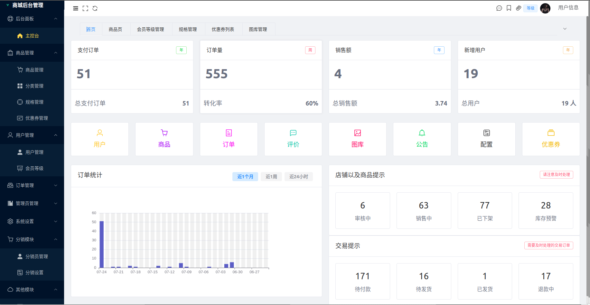
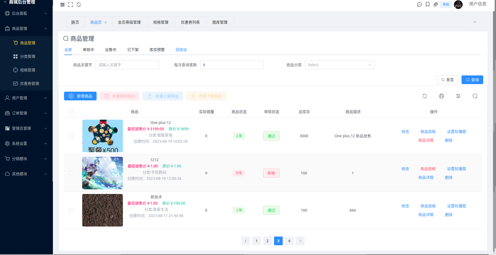
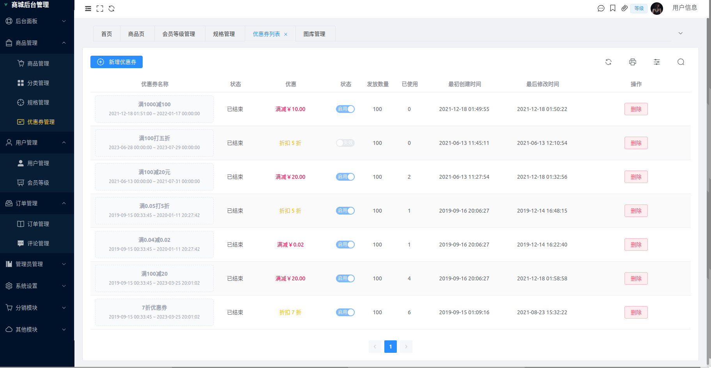
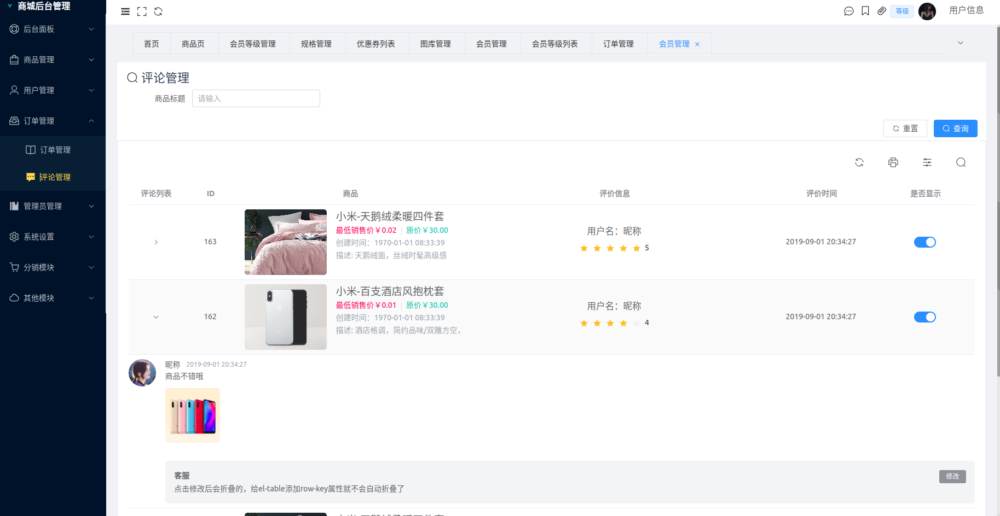
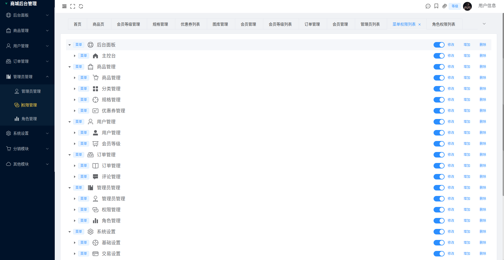
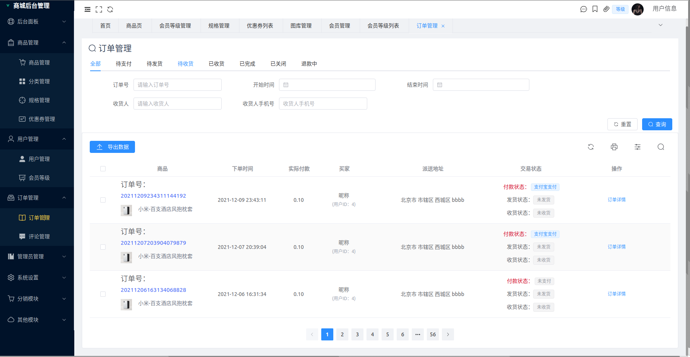
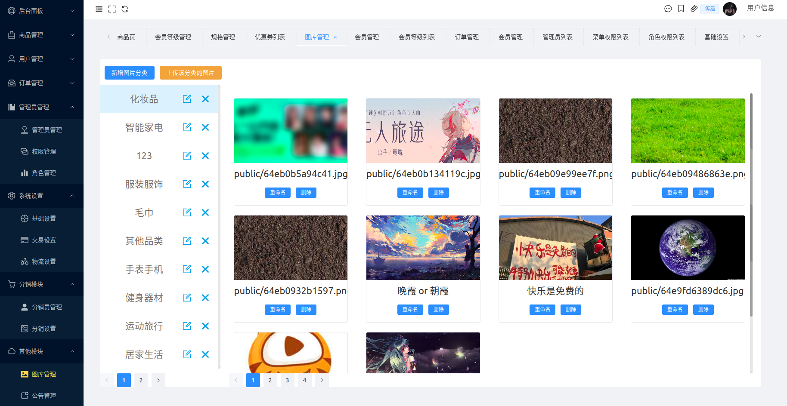

# Vue3 + TS 实战商城后台管理系统开发

> 作者 hexianWeb

此项目是对 网易云课堂 [Vue3 实战商城后台管理系统开发](https:/study.163.com/course/introduction/1212775807.htm?inLoc=lmxq_sjlm_400000001334002_480000004203012&share=1&shareId=1390841715) 的一次全面改进。
对我来说，这是 **Vue3 实战商城后台管理系统开发** 是一个很好的项目，仅仅存在一些很小的瑕疵！这些应该都是老师为了照顾技术还没有那么成熟的学院做出的牺牲！
没有加入 typescript 、tsx 、组件封装功能过少，这些都是我在看这门课时想要去改进的东西。我觉得这是一很好的项目，不应该因为一点点的缺憾而被学员在选择课程时因为 “技术栈不够新” 而从学习计划删除掉！我绝对翻新这门课程的代码，和想要进阶的同学一起看看这个项目的**终极形态**

## 项目概览

本项目基于原帝莎 IT 学院 《 Vue3 实战商城后台管理系统开发》的二次改进与开发。

基于 Vue3 + ElementPlus + Vite + TypeScript + TailwindCss 实战开发商城后台管理系统

其中包括 Vite 的使用，Vue3 全新的`<script setup>`语法，vuex4、Vue-router4、使用 ElementPlus & TailwindCss 库。

后台管理系统包含数据面板、轮播图管理、商品管理、订单管理、会员管理、分类管理、设置等模块。

## 项目演示 (部分页面)

**主控台页面**



**商品页面**



**优惠券页面**



**评论页面**



**权限页面**



**订单管理**



**图库管理**



**评论管理**


## 项目结构

```
├── src
│   ├── api															# API 接口管理
│   ├── App.vue														# 项目主组件
│   ├── assets														# 静态资源文件
│   ├── base-ui														# 基础样式组件
│   ├── components													# 业务组件
│   ├── constants													# 全局配置项
│   ├── directives													# 全局指令文件
│   ├── hooks														# 常用 Hooks 封装
│   ├── main.ts														# 项目入口文件
│   ├── router														# 路由管理
│   ├── service														# 请求封装
│   ├── stores														# 全局数据管理
│   ├── utils														# 常用工具类
│   ├── views														# 页面视图集
|    |   ├── access														# 权限管理页面
|    |   ├── category													# 分类管理
|    |   ├── comment													# 评论管理
|    |   ├── coupon														# 优惠券管理
|    |   ├── distribution												# 分销管理
|    |   ├── goods 														# 商品管理
|    |   ├── image														# 图库管理
|    |   ├── index														# 主控台
|    |   ├── level														# 会员等级
|    |   ├── login														# 登录页面
|    |   ├── main														# router View 挂载组件
|    |   ├── manager													# 管理员管理
|    |   ├── not-found													# 404 页面
|    |   ├── notice														# 公告管理
|    |   ├── order														# 订单管理
|    |   ├── role														# 角色管理
|    |   ├── setting													# 基础设置
|    |   ├── skus														# 规格管理
|    |   └── user														# 用户管理
|   └── vite-env.d.ts
├── tailwind.config.js
├── tsconfig.json
├── tsconfig.node.json
└── vite.config.ts
├── auto-imports.d.ts
├── CHANGELOG.md
├── commitlint.config.js
├── components.d.ts
├── index.html
├── package.json
├── pnpm-lock.yaml
└──  postcss.config.js
```

## 本地开发环境配置

- 克隆项目到本地

```apl
https://github.com/hexianWeb/Mall_manager_Pro.git
```

- 安装依赖

```bash
pnpm install 
```

- 本地启动

```basic
pnpm run dev
```

## 最后一些话

我知道人各有志，这个项目落地能跑。你可以那这个去应付老师啊，参加一些院级校级比赛啊。因为我也是大学过来的，我知道有些东西确实就是浪费时间。所以我不会说这个项目你克隆过去但只能学习。还是那一句话，随便用。侵权删